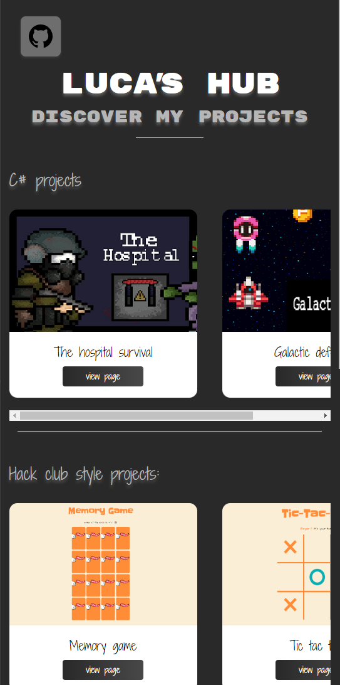

# Lucas Hub

Welcome to the Lucas Hub project! This is a website designed to <b>showcase my projects and achievements.</b>

## Description

The Lucas Hub project serves as a portfolio to highlight my work and skills. It provides a clean and organized platform to present my projects and their details.

## Preview

## Installation

No installation is required for the Lucas Hub project. Simply visit the website [here](https://luca611.github.io/lucas-hub) to explore my projects.

## Usage

Once you are on the Lucas Hub website, you can navigate through the different sections to view my projects. Each project will have a description, screenshots, and links to the live demo and source code.

## Contributing

As this is a personal showcase website, contributions are not accepted. However, feedback and suggestions are always welcome. Feel free to reach out to me through the contact information provided in my readme.
